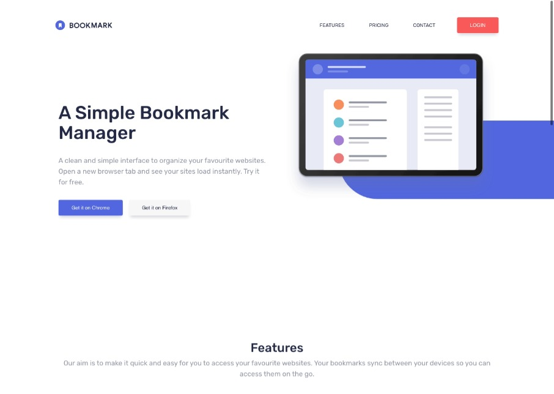
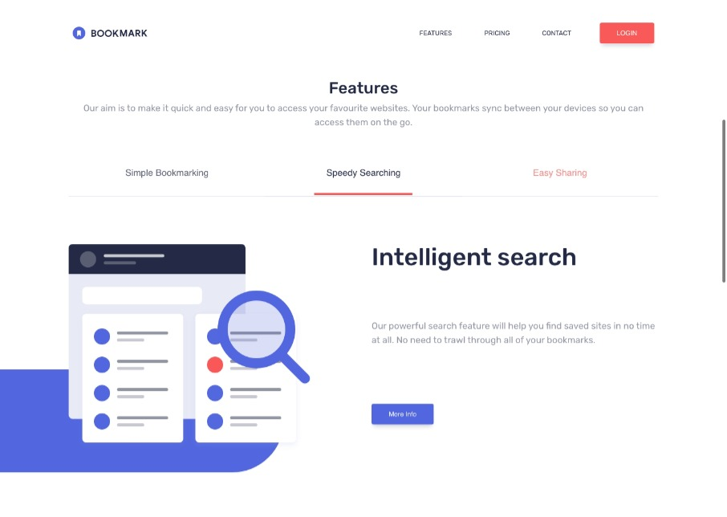
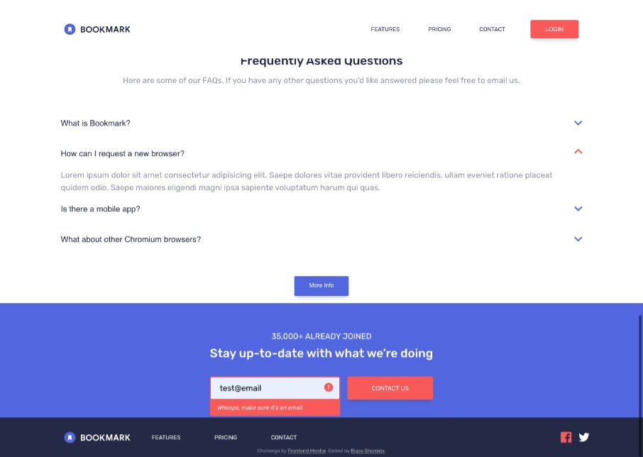
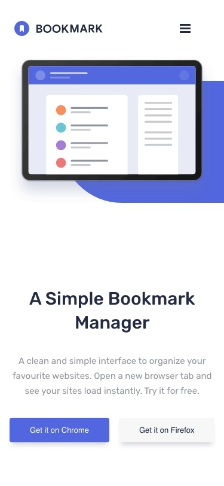
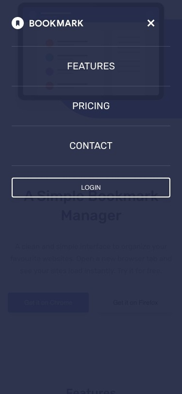
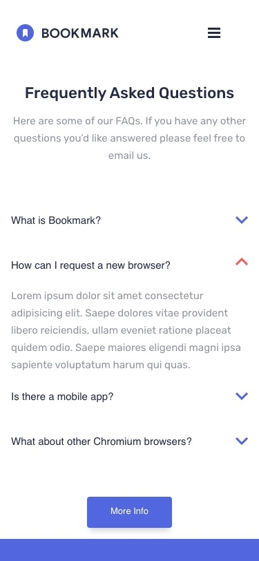
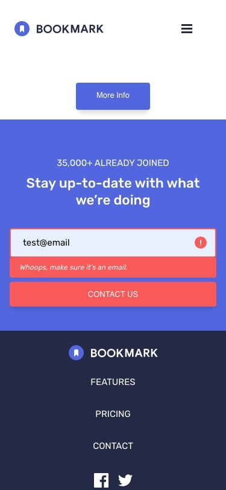
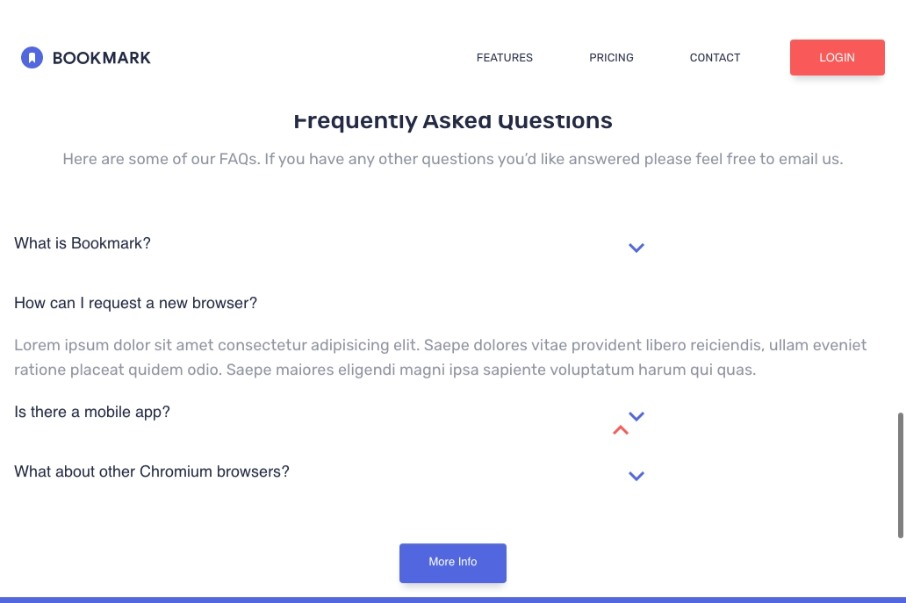
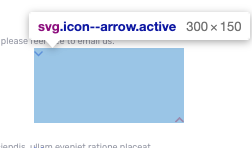
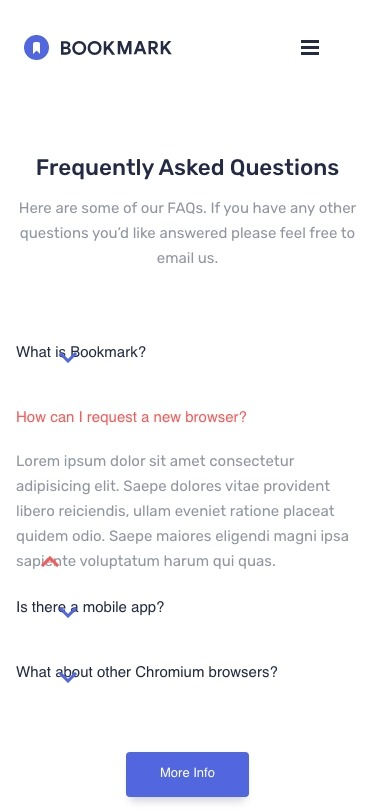

# Bookmark <!-- omit from toc -->

This is a solution to the [Bookmark landing page challenge on Frontend Mentor](https://www.frontendmentor.io/challenges/bookmark-landing-page-5d0b588a9edda32581d29158). Frontend Mentor challenges help you improve your coding skills by building realistic projects. 

This project has been a significant milestone in my development journey, marking my first venture into larger-scale projects beyond individual components. It was indeed a "challenge" that stretched my understanding and skillset, pushing me out of my comfort zone.

Several elements, such as the integration of tabs and an FAQ accordion, were initially foreign to me. Still, I relished the opportunity to learn and integrate these new components. I have shared more about these exciting discoveries in the "What I Learned" section.

This project demanded a deeper exploration of resources, particularly while addressing unique issues like modifying SVG colors on hover. It taught me the importance of adjusting my strategies and problem-solving approaches when confronted with new challenges.

In retrospect, this project has been incredibly rewarding. Not only did it broaden my knowledge base, but it also honed my problem-solving skills. It served as a reminder that every challenge encountered is an opportunity for growth. I am thankful for this project and the myriad lessons it brought with it.

## Table of contents <!-- omit from toc -->

- [Overview](#overview)
  - [The challenge](#the-challenge)
  - [Screenshot](#screenshot)
  - [Links](#links)
- [My process](#my-process)
  - [Built with](#built-with)
  - [What I learned](#what-i-learned)
  - [Continued development](#continued-development)
- [Author](#author)

**Note: Delete this note and update the table of contents based on what sections you keep.**

## Overview

### The challenge

The primary goal of this project, a Bookmark Landing Page, is to provide a responsive and interactive user interface. It offers optimal viewing and interaction experience across a wide range of devices, from desktop to mobile. The key functionalities users should expect are:

A design that adapts to the screen size of their device, ensuring optimal layout.
Visual feedback through hover states for all interactive elements on the page.
Robust form validation for the newsletter subscription, providing an error message if:
- The email input field is left blank.
- The email address entered is not correctly formatted.

### Screenshot

### Links

- Solution URL: [View solution URL here](https://www.frontendmentor.io/solutions/responsive-landing-page-using-css-grid-2oaR-1xDkQ)
- Live Site URL: [View live site URL here](https://blazeshomida.github.io/Bookmark-Landing-Page---Frontend-Mentor/)

## My process

### Built with

- Semantic HTML5 markup
- CSS custom properties
- Flexbox
- CSS Grid
- Mobile-first workflow
- CSS Animation

### What I learned

This project served as a significant learning experience and enabled me to enhance my development skills in several areas:

- Pseudo-elements: I discovered how to utilize ::before and ::after pseudo-elements to create dynamic shapes, notably within the hero and features sections.
- SVG Animation: I learned to manipulate SVG properties and animations, further expanding my repertoire of frontend skills.
- Form Validation: I delved into the fundamentals of form validation to improve user interaction and data integrity.
  
One of the notable challenges I encountered was handling SVGs without defined dimensions within the FAQ section, leading to oversized SVGs that were difficult to center. To resolve this, I adjusted the SVG's dimensions to match the original size, a strategy that reinforced the importance of adaptability and problem-solving in web development.

Another area of difficulty involved implementing custom form validation and error messaging. This required fine-tuning the positioning of the error message and icon, a process that underscored the importance of both technical knowledge and aesthetic vision.

Through these challenges, I learned to appreciate the intricacies of frontend development and the satisfaction of enhancing user experience. This project has been a testament to the growth and learning opportunities that every challenge brings to a developer's journey.

### Continued development

As I continue to grow as a developer, I have identified several key areas for ongoing learning and improvement:

- Accessibility Optimization: Ensuring that my projects are accessible to all users is a top priority. I intend to further refine my understanding of accessibility standards and best practices, implementing them in all future projects.
- Code Optimization: As I encounter new challenges and learn new techniques, I aim to continuously refine my code. The goal is not just to create functional solutions, but also to ensure that my code is clean, efficient, and maintainable.
- CSS Animations: I have found working with CSS animations intriguing and plan to delve deeper into this area. Mastering CSS animations can greatly enhance user experience and the overall aesthetic appeal of my projects.
- Framework Learning: I am eager to start learning and working with popular JavaScript frameworks like React. Having seen the benefits these frameworks offer in terms of efficiency and scalability, I believe this will be a valuable addition to my skillset.
- 
In my journey as a developer, I aim to continuously learn, innovate, and strive to create web solutions that are not only functional and aesthetically pleasing but also accessible and user-friendly

## Author

- Github - [@blazeshomida](https://github.com/blazeshomida)
- Frontend Mentor - [@shomidamoney](https://www.frontendmentor.io/profile/shomidamoney)
